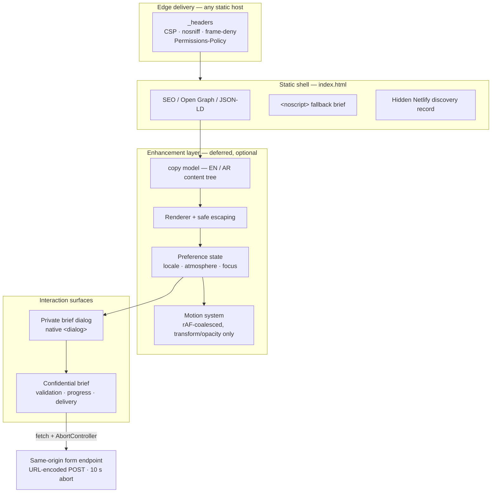
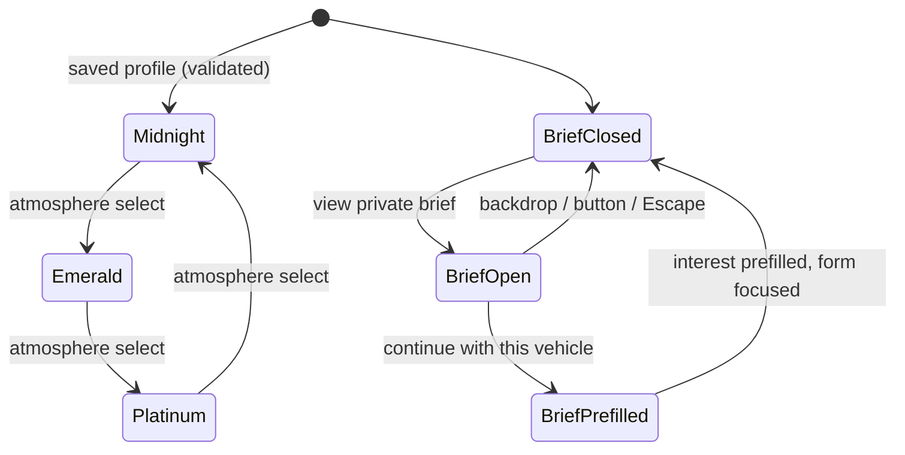
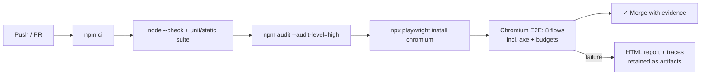

<div align="center">


# VIP Motors Atelier

### A bilingual, dependency-free luxury concierge experience — engineered like a system, not a page.

**Discreet vehicle sourcing · private viewings · white-glove ownership — delivered as a static, security-hardened, accessibility-gated single page.**

[Quickstart](#quickstart) · [System Architecture](#system-architecture) · [Feature Matrix](#feature-matrix) · [Core Workflows](#core-workflows) · [Tech Stack](#tech-stack) · [Quality Gates](#quality-gates) · [The Social Card](#the-social-card-og-image-animatedgif)

[](#tech-stack)
[](#performance--motion-budget)
[](#the-social-card-og-image-animatedgif)
[](#accessibility--internationalization)
[](#quality-gates)
[](#tech-stack)

</div>

---

## Executive summary

VIP Motors Atelier is a lead-capture landing experience for a private automotive concierge: plain HTML, CSS and browser JavaScript — **no framework, no build step, no runtime dependency, no application server, no database, no analytics SDK**. Everything a visitor sees is either semantic markup, tokenised CSS, or progressively-enhanced vanilla JS.

The engineering thesis is deliberate: **luxury is constraint.** A page that carries zero runtime dependencies, ships under a 150 KiB first-party budget, remains fully usable without JavaScript, passes automated accessibility audits in two languages and reading directions, and still delivers a cinematic obsidian-and-gold showroom — proves the brand's "quiet authority" through the technology itself.

> **Content ownership note** — vehicle names, availability labels, stats, locations and service claims in `script.js` are seeded presentation copy inherited from the original artifact. Validate or replace every business claim before publishing to a real audience.

### At a glance

| Dimension | Position |
| --- | --- |
| Runtime dependencies | **0** — packages in `package.json` are dev/test tooling only |
| First-party critical transfer | **95,448 B** uncompressed (enforced ceiling: 153,600 B) |
| First-party image/video/model assets in the page | **0** — the vehicle is CSS art; the favicon is a 312 B SVG |
| Locales | English + Arabic, full `lang`/`dir` switching with persisted preference |
| Conversion path | Collection → private specification dialog → prefilled confidential brief → resilient same-origin POST |
| JavaScript unavailable | Full confidential brief retained via semantic `<noscript>` fallback |
| Social card | `assets/og-image-animated.gif` — 1200×630, 36-frame seamless loop, 1.9 MB, purpose-synthesised |
| Security | Same-origin CSP in markup **and** host headers, honeypot, 10 s abortable delivery, `npm audit` gate |
| Verification | 6 unit/static tests, 8 Chromium E2E flows (a11y + performance tagged), CI on every push and PR |

---

## System Architecture

### Architectural principle

The system is a **static shell with progressive enhancement**, deployed to the edge. There is no hydration, no SSR, no client runtime — the shell renders, an optional deferred script enhances, and the delivery plane is a static host's form endpoint.



### Module responsibility map

| Path | Layer | Responsibility |
| --- | --- | --- |
| `index.html` | Shell | Semantic document, SEO/Open Graph/JSON-LD, content-security-policy meta, favicon, skip link, hidden Netlify form discovery record, `<noscript>` consultation fallback, deferred entry script. |
| `style.css` | Presentation | Tokenised visual system (`:root` custom properties), responsive CSS-art vehicle, atmosphere profiles (Midnight / Emerald / Platinum), glass controls, dialogs, form states, `prefers-reduced-motion` alternatives. |
| `script.js` | Enhancement | Bilingual `copy` model, defensive HTML escaping of every rendered string, full-page renderer, preference state (guarded `localStorage`), dialog/menu/focus management, form progress + resilient delivery. |
| `assets/mark.svg` | Brand | 312 B vector favicon. |
| `assets/og-image-animated.gif` | Brand | Social sharing card — 1200×630 looping GIF, synthesised by the asset pipeline. |
| `tools/og/` | Build tooling | Deterministic social-card synthesiser (base plate, brand fonts, generator, verification). Not part of the runtime surface. |
| `_headers` | Security | Netlify security header policy mirroring the in-page CSP. |
| `tests/unit/site.test.mjs` | Verification | Static policy + budget assertions and a Happy-DOM characterisation of the conversion flow. |
| `tests/e2e/site.spec.mjs` | Verification | Chromium flows: locale persistence, atmosphere, mobile navigation, dialog→form conversion, delivery, no-JS, axe, transfer/DOM budgets. |
| `.github/workflows/quality.yml` | CI | Install → static gate → audit → browser suite; failure artifacts retained. |

### State model

The enhancement layer keeps exactly one serialisable preference set and one transient interaction state:



**Invariants** (all covered by the automated suite):

- The locale switch updates `<html lang>` **and** `dir`, the document title, and the description/OG metadata — not merely visible strings — and persists only the locale preference.
- The atmosphere selector accepts exactly `midnight`, `emerald`, `platinum`; unknown saved values fall back to Midnight.
- A private brief renders only for a known collection key; closing by button, backdrop or Escape returns focus to its opener.
- Continuing a brief preselects the matching `interest`, preserves all other in-progress form values, scrolls to the form and focuses the name field.
- Form progress equals the count of non-empty required controls (notes stay optional).
- Re-rendering (locale or atmosphere change) restores in-progress form values from the previous DOM before replacing it.

---

## Feature Matrix

| # | Capability | Visitor outcome | Implementation | Verified by |
| --- | --- | --- | --- | --- |
| 1 | Bilingual shell (EN ⇄ AR) | Switches language and reading direction with full document semantics | `copy` model + `lang`/`dir` re-render + guarded storage | unit · e2e (persistence across reload) |
| 2 | Signature atmospheres | Chooses Midnight / Emerald / Platinum showroom profiles, no imagery downloaded | CSS custom-property profiles on the CSS-art stage | e2e (class + `aria-pressed` + persistence) |
| 3 | CSS-rendered vehicle | A sculpted grand coupe with glow, glass and wheels at zero asset cost | Pure CSS shapes/gradients, profile-tinted | transfer budget test |
| 4 | Private specification dialog | Inspects a vehicle brief before any commitment | Native `<dialog>`, backdrop/Escape close, focus return | unit · e2e |
| 5 | Dialog → form conversion | Arrives at the brief with the vehicle preselected | `data-brief` → `data-brief-request` → `interest` prefill + focus | unit · e2e |
| 6 | Brief completion signal | Sees real-time completion of required lead fields | Accessible `role="progressbar"` with `aria-valuenow`/`aria-valuetext` | unit · e2e (resets after success) |
| 7 | Resilient delivery | Submits safely; never hangs; failures are graceful | `fetch` URL-encoded same-origin POST, `AbortController` 10 s timeout, generic error copy, honeypot | unit (source contract) · e2e (success path) |
| 8 | No-JavaScript path | Can still send a complete confidential brief | Semantic `<noscript>` form with identical payload shape | static test · e2e (JS-disabled context) |
| 9 | Reduced motion | Gets an instantly-available, calm experience | `prefers-reduced-motion` removes scanner/brief animation, resolves reveals | e2e + CSS review |
| 10 | Mobile navigation | Drawer receives focus, closes with Escape, returns focus | Inert when closed, focus management on open/close | e2e (390×844 viewport) |
| 11 | Accessibility | No known violations on the critical screen | Semantic landmarks, labels, live regions, skip link + **axe** | e2e `@a11y` (zero violations) |
| 12 | Performance budget | Fast first render on modest hardware | 95,448 B first-party critical transfer, < 500 DOM nodes | unit + e2e `@performance` |
| 13 | Security posture | Hardened static client | CSP (markup + headers), `object-src 'none'`, `frame-ancestors 'none'`, nosniff, strict referrer, deny-by-default Permissions Policy, escaping, `npm audit` | static tests · audit gate |
| 14 | Social card | Premium animated share preview everywhere the link travels | Purpose-synthesised 1200×630 looping GIF wired into OG/Twitter/JSON-LD | unit (asset policy gate) |
| 15 | CI quality gate | Every push and PR proves the above | GitHub Actions: install → check → audit → Chromium suite | workflow on this branch and PRs |

---

## Core Workflows

### W1 — The conversion spine

From anonymous arrival to a qualified, correctly-prefilled confidential brief in four moves:

```mermaid
sequenceDiagram
  participant V as Visitor
  participant R as Renderer (script.js)
  participant D as Private brief dialog
  participant F as Confidential brief form
  participant H as Static host / form endpoint

  V->>R: Land; deferred script enhances the shell
  R->>R: Render locale + atmosphere from persisted preference
  V->>D: "View private brief" on a collection card
  D-->>V: Focused specification sheet (Escape/backdrop safe)
  V->>D: "Continue with this vehicle"
  D->>R: Close, return focus, hand off the collection key
  R->>F: Preselect interest · preserve other values · scroll · focus name field
  V->>F: Complete required fields (progress announced live)
  V->>F: Submit
  F->>F: Native validation + honeypot must pass
  F->>H: URL-encoded same-origin POST (AbortController, 10 s)
  H-->>F: 200 or error
  F-->>V: Polite live-region success / failure; progress resets
```

### W2 — Preference persistence

1. Visitor switches locale or atmosphere → state updates → `render()` rebuilds the page from the escaped `copy` tree.
2. In-progress form values are snapshotted from the previous DOM and re-applied — a language switch never destroys a half-written brief.
3. Only `vip-motors-language` and `vip-motors-visual-mode` are persisted, each wrapped in `try/catch` (storage is an optional enhancement, never a dependency).

### W3 — Delivery resilience

| Condition | Behaviour | Guarantee |
| --- | --- | --- |
| JavaScript enabled, network healthy | URL-encoded same-origin POST with `credentials: "same-origin"` | Payload identical to the hidden discovery record |
| Endpoint slow / hung | `AbortController` cancels after `FORM_TIMEOUT_MS = 10000` | Visitor is never left on a stuck button |
| Endpoint error / abort | Generic, human failure message in a polite live region | No exception text or internals leak to the visitor |
| Honeypot field filled | Submission is not attempted | Bot traffic never reaches the endpoint |
| JavaScript disabled | Semantic `<noscript>` form POSTs the same payload shape (`name`, `email`, `interest`, `timeline`, `channel`, `notes`) | The lead path survives total enhancement failure |

### W4 — Social card synthesis (the `og-image-animated.gif` pipeline)

The social card is not a screenshot — it is **generated as a build artifact** by `tools/og/generate_og.py`, fully deterministic and re-runnable:

```mermaid
flowchart LR
  A["Cinematic base plate<br/>(committed PNG)"] --> B["Grade + adaptive scrim<br/>+ film grain"]
  B --> C["Scene analysis<br/>horizon & glow centroid detected from pixels"]
  C --> D["Typography lockup<br/>Playfair Display + Manrope<br/>measured, safe-area asserted"]
  D --> E["Light choreography<br/>sweep · gold dust · rule glint<br/>amplitude-lattice snapped"]
  E --> F["Screen blend onto plate<br/>one global 256-colour palette"]
  F --> G["Frame-differenced GIF89a<br/>disposal=1 · transparent deltas"]
  G --> H["Round-trip verification<br/>every frame re-renders pixel-faithfully"]
```



Key engineering decisions, each of which is asserted at generation time:

- **Loop mathematics.** Every effect is parameterised on `t ∈ [0,1)` with integer harmonics; the loop seam measures **0.77/255** mean delta against a 0.74 body average — mathematically seamless.
- **Temporal amplitude lattices.** Effect intensities snap to discrete steps so a region only re-encodes when its amplitude crosses a boundary. This (plus inter-frame transparency differencing) took the file from **6.5 MB to 1.9 MB** with no visual downgrade.
- **Frame 0 is a complete poster.** Crawlers that do not animate GIFs render the full brand card; animating consumers (Slack, X, and others, behaviour varies by platform and evolves) show the choreography.
- **Self-verification.** After encoding, the script decodes the file through Pillow's own GIF compositor and asserts every frame renders exactly as intended — the pipeline ships without human eyes and proves itself instead.

Regenerate after any brand/copy change:

```bash
pip install pillow numpy arabic-reshaper python-bidi   # build-time only
npm run og:regenerate                                   # → assets/og-image-animated.gif
```

### W5 — Continuous verification



---

## Tech Stack

| Layer | Choice | Version | Why this and not the obvious alternative |
| --- | --- | --- | --- |
| Document | Semantic HTML5, hand-authored | — | Server-renderable as-is; no hydration tax, meaningful without CSS/JS |
| Styling | Hand-authored CSS, custom properties, `backdrop-filter` | — | Design tokens in the cascade; atmosphere switching costs one class change, not a theme runtime |
| Logic | Vanilla ECMAScript, one IIFE-free module | ES2022 | The interaction surface is small; a framework would cost more transfer than the entire page |
| i18n | Application-level `copy` model + `lang`/`dir` mutation | — | True document semantics per locale, persisted client-side, zero i18n runtime |
| Dialogs | Native `<dialog>` | — | Free focus trapping, Escape and top-layer; a JS focus-trap is the fallback, not the default |
| Delivery | Static host + Netlify-compatible form endpoint | — | The trust boundary is the host's endpoint; no server code of ours to attack or operate |
| Unit testing | `node:test` + Happy DOM | Node ≥ 20 · happy-dom 20 | Stdlib runner; DOM characterisation without a browser |
| E2E testing | Playwright (Chromium) + axe-core | Playwright 1.63 · axe 4.13 | Real-browser conversion, a11y and budget flows in CI |
| Security policy | CSP in markup + Netlify `_headers` | — | Defence in depth: policy holds even if one layer is stripped |
| Social card tooling | Python + Pillow + NumPy (+ fontTools, arabic-reshaper) | Python 3.11 | Deterministic image synthesis; build-time only, never shipped |
| Brand type | Playfair Display & Manrope (self-hosted for the card, Google Fonts for the page with system fallbacks) | — | The card bakes the exact brand fonts as vectors of the layout; the page degrades gracefully offline |
| CI | GitHub Actions | Node 22 runner | Install → check → audit → browser suite, artifacts on failure |

---

## Quickstart

### Preview in one command (no install)

```bash
python3 -m http.server 4173 --bind 0.0.0.0
```

Open `http://localhost:4173`. A plain Python server does **not** process form POSTs or apply `_headers` — those belong to the production host.

### Full contributor setup

```bash
npm ci
npx playwright install chromium
npm test          # unit + static gates, then the Chromium suite
```

Requirements: Node.js ≥ 20 and Python 3. The shipped site itself has **no runtime package dependency**.

---

## Performance & Motion Budget

### Measured, enforced, and honest

| Metric | Value | Enforcement |
| --- | --- | --- |
| First-party critical transfer (uncompressed) | **95,448 B** (`index.html` + `style.css` + `script.js` + `assets/mark.svg`) | Unit + browser tests: `< 153,600 B` (150 KiB) |
| Headroom against the ceiling | 58,152 B | — |
| First-party image / video / 3D assets in the page | **0** — CSS vehicle art + 312 B SVG favicon | Transfer budget test |
| DOM nodes | **< 500** | Playwright `@performance` |
| Social card | 2,019,902 B, fetched by crawlers only — **not** part of the page's critical path | Unit policy gate: ≤ 2.5 MB, 1200×630, loop-forever extension |

The first-party critical surface grew from 74,296 B (original checked-in shell) to 95,448 B across the upgrade series because it now carries a real no-JS path, dialog flow, atmosphere profiles, focus management and delivery resilience. These are uncompressed source measurements — not substituted network-transfer or Core Web Vitals claims.

> **Field-data caveat.** This repository ships a browser performance test, but no desktop browser binary was available in the authoring workspace, so no FPS, LCP, INP or CLS number is claimed. Run `npx playwright install chromium && npm run test:performance` locally or in CI, and measure production field data before publishing any performance score.

### Motion system contract

| Behaviour | Rule |
| --- | --- |
| Reveals | 800 ms `cubic-bezier(0.22, 1, 0.36, 1)` — opacity + translate only |
| Pointer depth | Fine-pointer only, `requestAnimationFrame`-coalesced, ±3° maximum |
| Scanner / dialog scan | Transform + opacity only; subdued 8 s / 5 s loops |
| Scroll indicator | Passive listener, one frame per update |
| Reduced motion | Reveals resolve instantly; scanner and brief scan removed — motion is never the only carrier of information |

---

## Accessibility & Internationalization

- Semantic `<main>`, `<nav>`, `<section>`, `<article>`, `<aside>`, `<footer>`; labelled controls; visible focus treatment; skip link; polite live regions for form and language announcements.
- English and Arabic are first-class: switching updates `lang` and `dir` and the document metadata; the layout mirrors under RTL (progress bar, nav, ambient accents).
- Native dialog semantics with focus return; the mobile drawer receives focus on open and restores it on Escape.
- Responsive to 320 px; collection cards become a touch-friendly horizontal rail on small screens.
- The Chromium suite runs **axe** on the critical screen and asserts zero violations.
- Manual review is still required for real copy quality, Arabic translation quality, and final contrast on the production font stack.

---

## Security Posture

This is a public static client, not an authentication system. Its trust boundary is the incoming visitor and the host's form endpoint.

| Control | Implementation |
| --- | --- |
| Output escaping | Every string from the content model is defensively escaped before it reaches the renderer's template |
| Content Security Policy | Same-origin CSP in both HTML meta and Netlify `_headers`; executable scripts restricted to the local deferred entry file |
| Framing / plugin defense | `object-src 'none'`, `base-uri 'self'`, `frame-ancestors 'none'`, `X-Frame-Options: DENY` |
| Transport hygiene | `nosniff`, strict referrer policy, deny-by-default Permissions Policy, cross-origin opener policy |
| Form abuse | Honeypot field, native required/email constraints, same-origin `form-action`, 10 s cancellation, generic visitor-facing failures |
| Supply chain | `npm audit --audit-level=high` in local commands and CI |

**Host responsibilities.** `_headers` is a Netlify convention — on another provider, translate the policy into that provider's native configuration and verify with an HTTPS response check. Never add secrets, API keys, personal addresses or CRM tokens to this repository or client JavaScript.

---

## Deployment & Forms

1. Publish the repository root to any static host.
2. On Netlify, keep the visible form name as `vip-consultation` — the hidden discovery record makes it discoverable and the enhanced request posts URL-encoded data to the same origin.
3. Configure the legitimate destination/notification flow in the host or connected CRM. This repository intentionally contains no destination address or credential.
4. Verify a submission on the deployed HTTPS domain, then verify response headers: `curl -I https://YOUR-DOMAIN.example`.
5. If the host cannot process Netlify-style forms, preserve the field names and replace the `action`/delivery implementation with an owned, authenticated backend — maintain the same success/error accessibility contract.

> The local Python server returns no form handler; an error state there is expected and demonstrates the visitor-facing fallback path, not delivery.

---

## The Social Card — `og-image-animated.gif`

The share preview is the brand's first impression in a feed, so it is treated as a **first-class engineered artifact** rather than an afterthought:

- **Canvas** — 1200×630 (the Open Graph standard), 36 frames at 80 ms → a 2.88 s loop that never visibly seams.
- **Design language** — the site's own tokens: obsidian depths, champagne-gold light, the rotated-square brand seal, and the real brand typography (Playfair Display wordmark, Manrope micro-labels, Arabic "بالموعد فقط" accent) — pixel-measured into a safe column with a contrast guard asserting the backdrop stays near-black.
- **Choreography** — four restrained motions: a diagonal gold specular sweep gliding across the lockup, drifting gold bokeh dust, a glint running along the hairline rule, and fixed ambient showroom glow baked into the plate (animating sub-perceptual ambience was measured and rejected — it re-encoded entire regions every frame for no visible gain).
- **Weight discipline** — 1.9 MB after amplitude-lattice snapping, a single global 256-colour palette (no flicker), and inter-frame transparency differencing (unchanged pixels cost ~nothing). Policy gate: ≤ 2.5 MB, enforced in the unit suite.
- **Graceful degradation** — frame 0 is a complete static poster, so platforms that freeze GIFs still show the full brand card.
- **Wiring** — `og:image` (+ `secure_url`, `type`, `width`, `height`, `alt`, locales) and `twitter:card summary_large_image` in `index.html`, plus the `image` field in JSON-LD. Paths are relative until a canonical production domain exists; prefix with the origin when it does (some strict crawlers require absolute URLs).
- **Provenance** — base plate generated with an AI image model and committed alongside the deterministic synthesiser; typography from the brand's open-licensed fonts committed under `tools/og/fonts/` (SIL OFL). Regenerate with `npm run og:regenerate`.

---

## Customization Guide

### Copy

Edit only the `copy.en` and `copy.ar` records in `script.js`. Keep keys and option values matched across locales — the interaction code uses values such as `grand-coupe`, `hybrid-gt` and `executive-suv` as stable form identifiers.

Before launch, replace or validate: service/location statements; all availability, power, timing and fleet metrics; claims involving client types, logistics, privacy or global support; Open Graph and structured-data URL values once a canonical domain exists.

### Design tokens

The visual system begins at the top of `style.css`: `--ink`, `--surface`, `--text`, `--muted`, `--gold` (palette); `--sans` / `--display` (typography); `--ease` (choreography). Atmosphere profiles live under the *high-tech luxury system* section at the end of the file. Keep scanner and dialog effects transform/opacity-only, and do not replace the CSS vehicle with unlicensed imagery without setting a new measurable budget.

### Social card

Update `tools/og/base.png` (or the typography constants in `tools/og/generate_og.py`) and run `npm run og:regenerate`. The unit gate re-checks dimensions, size and wiring.

---

## Quality Gates

| Command | Verifies |
| --- | --- |
| `npm run check` | JS parses; security/no-JS/header/budget/social-card checks pass; Happy DOM characterises locale, dialog, prefill, progress and successful delivery |
| `npm run test:e2e` | Chromium: locale persistence, atmosphere selection, mobile Escape/focus, dialog→form conversion, delivery feedback, no-JS fallback, axe accessibility, first-party transfer/DOM budgets |
| `npm run test:a11y` | The tagged axe flow only |
| `npm run test:performance` | The tagged transfer/DOM budget flow only |
| `npm run audit` | Fails on high-severity npm advisories |
| `npm run og:regenerate` | Rebuilds the social card deterministically (Python/Pillow toolchain) |

CI (`.github/workflows/quality.yml`) runs the full ladder on pushes to this branch and `main`, on pull requests, and on demand; failure screenshots/traces and the HTML report are retained as artifacts.

---

## Operational Checklist

- [ ] Validate every public business statement in both languages.
- [ ] Set the canonical URL; prefix OG/Twitter/JSON-LD image paths with the origin.
- [ ] Verify actual host form delivery, retention policy and rate limiting.
- [ ] Translate `_headers` if the host is not Netlify.
- [ ] Run every command in [Quality Gates](#quality-gates), including the browser suite.
- [ ] Test keyboard flow, mobile drawer, Arabic RTL and reduced motion on the deployed HTTPS domain.
- [ ] Measure production LCP/INP/CLS on representative mobile hardware before adding heavier visuals.

---

## Asset Provenance & License

No license file was present in the supplied repository — treat source and brand material as private until the owner adds an explicit license.

| Asset | Origin | License / action |
| --- | --- | --- |
| Layout, CSS vehicle, effects, scripts | Original source in this repository | Verify project ownership before reuse |
| `assets/mark.svg` | Created in this upgrade | Project-owned; add a license before redistribution |
| `assets/og-image-animated.gif` + `tools/og/base.png` | AI-generated base plate, programmatic synthesis in this repo | Project-owned; add a license before redistribution |
| `tools/og/fonts/*.ttf` | Playfair Display & Manrope (Google Fonts) | SIL Open Font License 1.1 — redistribution with the license preserved is permitted |
| Google Fonts (page load) | Google Fonts CDN | Subject to their font licenses; self-host or document consent/privacy needs |

---

## Known Deployment Unknowns

- The form destination, retention rules, rate limiting, consent language and CRM integration are host/business decisions not present in the repository.
- A production canonical URL is not yet known; OG/Twitter paths are relative and documented accordingly.
- Production visual performance (FPS, LCP, INP, CLS) requires a real browser and deployed-host measurement; source-size budgets are not substitutes for field data.
- Social-platform GIF behaviour varies and evolves; the card is designed so its static first frame is a complete, on-brand poster regardless.
