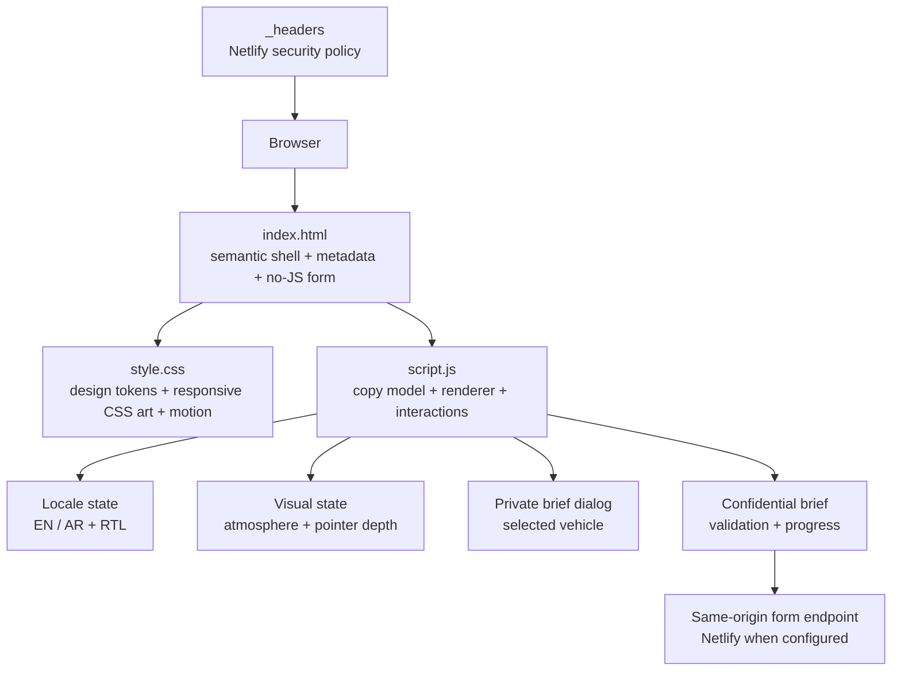

<div align="center">

# VIP Motors Atelier

### High-tech luxury for private automotive concierge

**A bilingual, dependency-light landing experience for discreet vehicle sourcing, private viewings, and white-glove ownership.**

[Run locally](#run-locally) · [Test it](#quality-gates) · [Deploy it](#deployment-and-forms)

</div>

---

## What this is

VIP Motors Atelier is a static marketing and lead-capture experience for a fictional/private automotive concierge concept. It ships as plain HTML, CSS, and browser JavaScript: there is no application server, database, analytics SDK, framework hydration, WebGL runtime, stock photography, or product model to load.

The design direction is **high-tech luxury, not sci-fi decoration**: obsidian surfaces, restrained gold/sage/platinum signals, glass controls, a CSS-rendered vehicle, an opt-in atmosphere selector, and low-frequency scan-line motion. Every effect has a reduced-motion fallback and the page remains useful when JavaScript is unavailable.

> **Content ownership note:** vehicle names, availability labels, stats, locations, and service claims in `script.js` are seeded presentation copy inherited from the artifact. Validate or replace those business claims before publishing to a real audience.

## Definition of done

A successful release is fast to first render, understandable with keyboard/screen reader/reduced-motion settings, readable in English and Arabic RTL, secure by default for a static site, and able to move a qualified visitor from collection discovery to a correctly prefilled confidential brief without a framework or large media asset.

---

## Experience map

| Surface | Visitor outcome | Implementation |
| --- | --- | --- |
| Hero / signature atmosphere | Chooses Midnight, Emerald, or Platinum visual profile without loading imagery or 3D. | CSS custom properties, CSS art, persistent local preference, transform/opacity-only scanner. |
| Curated collection | Opens an accessible vehicle-specific private brief before commitment. | Native `<dialog>` with modal fallback, focus return, Escape/backdrop close. |
| Bilingual shell | Switches English ↔ Arabic and updates `lang`, `dir`, title, metadata, and stored preference. | `copy` model in `script.js`, guarded local storage. |
| Confidential brief | Captures identity, interest, timing, preferred next step, and optional notes with completion feedback. | Native validation, accessible progressbar, Netlify-compatible URL-encoded POST, 10-second abort path. |
| Failure / no-JS path | Keeps a functional confidential brief when enhancement is unavailable. | Semantic `<noscript>` fallback form. |

### New high-tech luxury capabilities

1. **Signature atmosphere control** — three visual vehicle profiles change the CSS-rendered showroom state and persist locally. No image, video, model, or shader is downloaded.
2. **Private specification dialog** — each collection item now opens a focused, keyboard-safe specification brief and passes the selected vehicle into the concierge form.
3. **Brief completion signal** — required lead details show real-time completion status and reset after a successful handoff.
4. **Delivery resilience** — the enhanced POST is same-origin, honeypot-aware, reports success/error accessibly, and aborts after 10 seconds rather than hanging indefinitely.

---

## Architecture



### File responsibilities

| Path | Responsibility |
| --- | --- |
| `index.html` | SEO/Open Graph/JSON-LD shell, content security meta policy, favicon, skip link, no-JS consultation fallback, deferred entry script. |
| `style.css` | Tokenized responsive visual system, CSS vehicle art, luxury effects, dialogs, form states, reduced-motion behavior. |
| `script.js` | Bilingual content model, safe text escaping, full-page renderer, preference state, modal/menu/focus behavior, form submission. |
| `assets/mark.svg` | Original lightweight browser icon (312 B). |
| `_headers` | Netlify-compatible CSP and browser security headers. |
| `tests/unit/site.test.mjs` | Static policy/budget assertions plus DOM runtime characterization of the primary conversion flow. |
| `tests/e2e/site.spec.mjs` | Browser flow, no-JS, accessibility, and performance tests. |
| `.github/workflows/quality.yml` | CI install, audit, static checks, Playwright install, and browser verification. |

### Runtime sequence

```mermaid
sequenceDiagram
  participant V as Visitor
  participant R as Renderer
  participant D as Private brief dialog
  participant F as Concierge form
  participant H as Static host / Netlify

  V->>R: Load shell; deferred script runs
  R->>R: Render selected locale and visual state
  V->>D: Choose “View private brief”
  D->>R: Continue with selected vehicle
  R->>F: Prefill `interest`; scroll and focus name field
  V->>F: Complete required details
  F->>F: Update accessible completion state
  V->>F: Submit
  F->>H: URL-encoded same-origin POST (10 s timeout)
  H-->>F: Success or error response
  F-->>V: Live success/error feedback
```

---

## Behavior contract

The following rules are intentional and covered by the automated suite:

- The locale selector changes `<html lang>` and direction (`ltr`/`rtl`), updates title/description, and persists only the locale preference in local storage.
- The hero profile only accepts `midnight`, `emerald`, or `platinum`; unknown saved values fall back to Midnight.
- A collection brief is rendered only for a known collection key. Closing it via its button, backdrop, or Escape returns focus to its opener.
- Continuing a brief must preselect the corresponding `interest` value, retain any other current form values, scroll to the form, and focus the name field.
- The form progress value equals the number of non-empty required controls. Notes remain optional.
- The visible form only sends if native validation passes and the honeypot is empty. The POST is URL-encoded, same-origin, cancellable after 10 seconds, and never exposes an exception message to the visitor.
- If JavaScript is disabled, the semantic fallback retains the full lead payload shape: `name`, `email`, `interest`, `timeline`, `channel`, and `notes`.
- `prefers-reduced-motion: reduce` removes scanner/brief animation and makes reveal content immediately available.

---

## Run locally

### Preview only (no install)

```bash
python3 -m http.server 4173 --bind 0.0.0.0
```

Open `http://localhost:4173`. A plain Python server does **not** process form POSTs or apply `_headers`; those are provided by the production host.

### Full contributor setup

```bash
npm ci
npx playwright install chromium
npm run test
```

Requirements: Node.js 20+ and Python 3. The source application itself has no runtime package dependency; packages are development/test tooling only.

---

## Quality gates

| Command | What it verifies |
| --- | --- |
| `npm run check` | JavaScript parses; header/no-JS/security/budget checks pass; Happy DOM characterizes locale, dialog, prefill, progress, and successful form behavior. |
| `npm run test:e2e` | Chromium checks language persistence, visual selection, mobile Escape/focus, dialog-to-form conversion, successful form feedback, no-JS fallback, axe accessibility, and first-party transfer/DOM budgets. |
| `npm run test:a11y` | Runs the tagged axe accessibility flow only. |
| `npm run test:performance` | Runs the tagged first-party transfer/DOM budget check only. |
| `npm run audit` | Fails for high-severity npm dependency advisories. |

### CI

GitHub Actions runs `npm ci`, installs Chromium, runs the static/runtime gate, performs `npm audit --audit-level=high`, and executes the Chromium suite on pushes to this Arena branch and pull requests. Failure screenshots/traces and the HTML Playwright report are retained as artifacts when available.

---

## Performance and motion budget

### Current measured local budget

- **First-party critical transfer:** **94,157 B** uncompressed (`index.html` + `style.css` + `script.js` + `assets/mark.svg`).
- **Enforced transfer budget:** **< 153,600 B** in unit and browser tests.
- **No first-party image/video/model asset:** CSS vehicle illustration and SVG favicon only.
- **External presentation dependency:** Google Fonts CSS/font files are optional; system font fallbacks are defined.
- **Browser node budget:** **< 500 nodes** in the Playwright performance test.

The original checked-in first-party shell measured **74,296 B** before this upgrade (HTML/CSS/JS/README total). The runtime critical surface is now **94,157 B** because it adds an actual no-JS path, dialog flow, visual profiles, focus management, form resilience, and safeguards; it remains **59,443 B** below the enforced 150 KiB budget. The number is an uncompressed source measurement, not a substituted network transfer or Core Web Vitals claim.

### Motion system

| Behavior | Rule |
| --- | --- |
| Reveals | 800 ms `cubic-bezier(0.22, 1, 0.36, 1)`, opacity + translate only. |
| Pointer depth | Fine-pointer only, `requestAnimationFrame` coalesced, ±3° maximum. |
| Scanner / dialog scan | Transform + opacity animation only; subdued 8 s / 5 s loops. |
| Scroll indicator | Passive scroll listener, one frame update at a time. |
| Reduced motion | All reveals resolve instantly; scanner and brief scan are removed. |

**Frame-rate / CWV note:** this repository has a browser performance test but no desktop browser binary was available in the current workspace, so no FPS, LCP, INP, or CLS value is claimed here. Run `npx playwright install chromium && npm run test:performance` locally or in CI to execute the browser budget. Do not publish a performance score without a production-host measurement.

---

## Accessibility and internationalization

- Semantic `<main>`, `<nav>`, `<section>`, `<article>`, `<aside>`, `<footer>`, labels, visible focus treatment, skip link, and live form feedback.
- English and Arabic both exist in the `copy` model. Switching locale updates `lang` and `dir`, not merely visible strings.
- Native dialog behavior is used when supported; the markup falls back to the `open` attribute. Close works by control, backdrop, and Escape.
- The mobile drawer receives focus on open and returns focus to its toggle on Escape.
- CSS is responsive down to 320 px; collection cards become a touch-friendly horizontal rail on small screens.
- Motion is never the only carrier of information and has a calm `prefers-reduced-motion` alternative.
- Axe is part of the browser suite. Manual review is still required for real copy, locale quality, and final contrast on the production font stack.

---

## Security posture

This is a public static client, not an authentication system. Its trust boundary is the incoming visitor and the host's form endpoint.

### Implemented controls

- Defensive escaping of every string from the content model before it reaches the renderer's HTML template.
- Same-origin CSP in both HTML metadata and Netlify `_headers`; executable scripts are restricted to the local deferred entry file.
- `object-src 'none'`, `base-uri 'self'`, `frame-ancestors 'none'`, `X-Frame-Options: DENY`, `nosniff`, a strict referrer policy, and a deny-by-default Permissions Policy in `_headers`.
- Same-origin form delivery, honeypot handling, native required/email constraints, timeout/cancellation, and generic visitor-facing failures.
- `npm audit` in local commands and CI.

### Host responsibilities

`_headers` is a Netlify convention. If you deploy to another provider, translate the policy into that provider's native header configuration and verify it with an HTTPS response check. Do **not** add secrets, API keys, personal addresses, or CRM tokens to this repository or client JavaScript.

---

## Deployment and forms

1. Publish the repository root to a static host.
2. For Netlify, leave the visible form name as `vip-consultation`; the static markup is discoverable and the enhanced request posts URL-encoded data back to the same origin.
3. Configure your legitimate destination/notification flow in the host or connected CRM. This repository intentionally contains no destination email address or credential.
4. Verify a successful submission on the deployed HTTPS domain, then verify response headers:

```bash
curl -I https://YOUR-DOMAIN.example
```

5. If a host does not support Netlify form handling, preserve the field names and replace the form `action`/delivery implementation with an owned, authenticated backend. Maintain the same success/error accessibility contract.

> The local Python server returns no form handler; an error state there is expected and proves the visitor-facing fallback path rather than proving delivery.

---

## Content and visual customization

### Copy

Edit only the `copy.en` and `copy.ar` records in `script.js`. Maintain matching keys and option values across locales; the interaction code uses values such as `grand-coupe`, `hybrid-gt`, and `executive-suv` as stable form identifiers.

Before launch, replace or validate:

- service/location statements;
- all availability, power, timing, and fleet/arrival metrics;
- any claims involving client types, logistics, privacy, or global support;
- Open Graph and structured-data URL values once a canonical domain exists.

### Design tokens

The visual system begins at the top of `style.css`:

- `--ink`, `--surface`, `--text`, `--muted`, `--gold` control palette;
- `--sans` / `--display` define typographic fallback stacks;
- `--ease` governs interaction choreography;
- profile-specific variables and selectors live under **High-tech luxury system** at the end of the file.

Keep scanner and dialog effects to transform/opacity. Do not replace the CSS vehicle with unlicensed imagery, a large video, or an unoptimized 3D model without setting a new measurable transfer and render budget.

---

## Operational checklist

- [ ] Validate every public business statement in both languages.
- [ ] Set the canonical URL and production OG image only after assets are owned/licensed.
- [ ] Verify actual Netlify/host form delivery and retention policy.
- [ ] Translate `_headers` if the host is not Netlify.
- [ ] Run all commands in [Quality gates](#quality-gates), including browser tests.
- [ ] Test keyboard flow, mobile drawer, Arabic RTL, and reduced motion on the deployed HTTPS domain.
- [ ] Measure production LCP, INP, CLS, and frame behavior on representative mobile hardware before adding heavier visuals.

---

## License and asset provenance

No license file was present in the supplied repository. Treat the source and brand material as private until the owner adds an explicit license.

| Asset | Origin | License / action |
| --- | --- | --- |
| CSS vehicle, effects, layout | Original source in this repository | Verify project ownership before reuse. |
| `assets/mark.svg` | Created in this upgrade | Project-owned with this repository; add an explicit project license before redistribution. |
| Google Fonts (Manrope, Playfair Display) | Google Fonts CDN | Subject to their respective font licenses; self-host or document consent/privacy requirements if needed. |

---

## Known deployment unknowns

- The form destination, retention rules, rate limiting, consent language, and CRM integration are host/business decisions not present in the repository.
- A production canonical URL and social sharing image are not known, so the project intentionally does not invent either.
- Production visual performance (FPS, LCP, INP, CLS) requires a real browser and deployed-host measurement; source-size budgets are not substitutes for field data.
